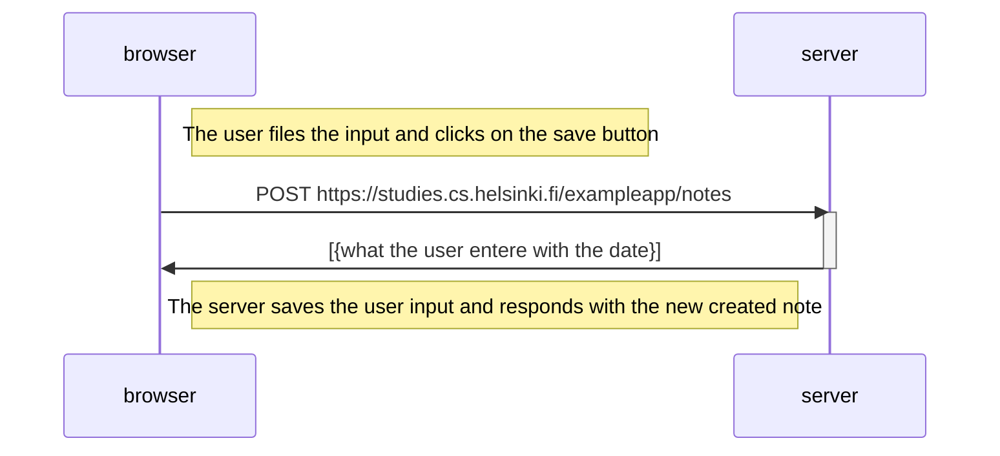

```mermaid
sequenceDiagram
    participant browser
    participant server

    Note right of browser: The user files the input and clicks on the save button

    browser->>server: POST https://studies.cs.helsinki.fi/exampleapp/notes
    activate server
    server->>browser: [{what the user entere with the date}]
    deactivate server

    Note right of browser: The server saves the user input and responds with the new created note 
```